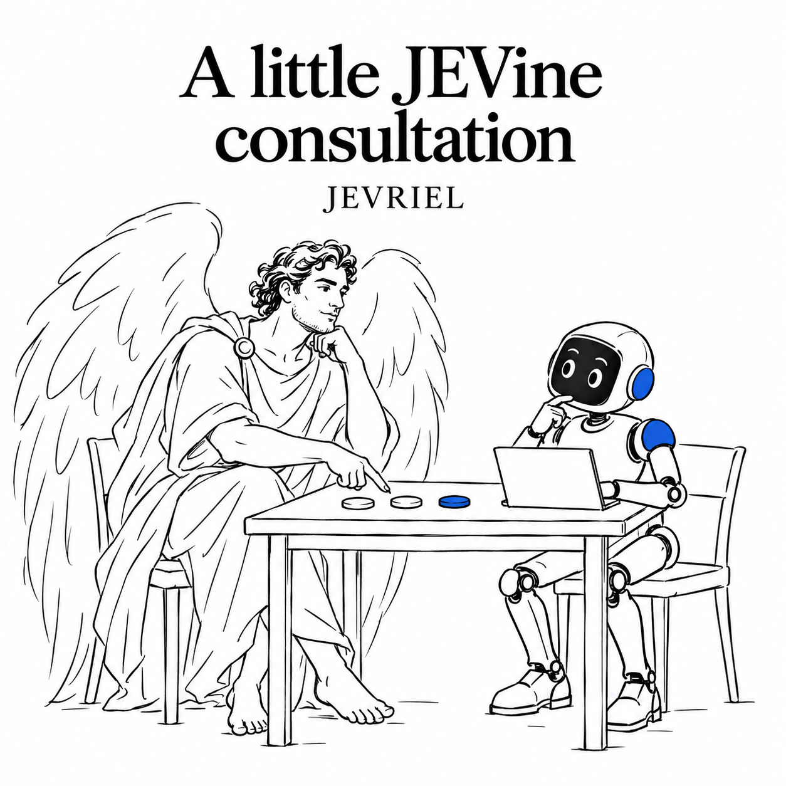

<p align="center">
  
</p>

# JEVRIEL

**Give your AI JEV wings.**

A skill and plugin that helps your AI agent build with TypeSafe JEV, upgrade existing LLM-only apps, and measure the results.

[Install](#install-in-one-line) · [Use cases](#four-ways-to-use-jevriel) · [Benchmark](#the-jevriel-flight-test) · [Documentation](docs/installation.md) · [Contribute](CONTRIBUTING.md)

**Codex · Claude Code · Portable skill** | [Apache-2.0 code and docs](LICENSE) | Early release

Start JEVing your work: find a useful decision point, integrate JEV, and get a short before-and-after report on latency, cost and quality. Provider setup is required unless you already have a working JEV connection. Frontier evaluation is still in progress.

### Why I built this

Daniel Kahneman's *Thinking, Fast and Slow* is, in my opinion, one of the most important books ever written. His account of fast, intuitive System 1 and deliberate System 2 gives me a useful way to think about building with AI. It also reminds me that fast judgment can be wrong. [About the book](https://www.penguinrandomhouse.com/books/89308/thinking-fast-and-slow-by-daniel-kahneman/).

TypeSafe's JEV brings a fast decision model into the software around an AI agent. Give it relevant state and defined questions; it returns choices, scores or yes/no probabilities that code can use. Independent questions can share one request and run in parallel. [TypeSafe's introduction](https://docs.typesafe.ai/introduction).

**I see this as a breakthrough in how we build with AI: a decision capability we can place throughout a workflow.** JEV can help the larger agent decide where to spend its reasoning, attention and computation. That is what I mean by an AI catalyst.

I've connected JEV and put it into the triage and classification stages of my morning agent. I also ran a paired classification test on 429 documents, covering 2.67 million characters. Those experiments led to JEVRIEL: a way to teach other agents this pattern and check whether it actually helps.

The angel supplies the wings. Your measurements decide whether they help.

### What JEV brings to the work

| At this junction | JEV can contribute | Your application retains |
|---|---|---|
| A request arrives | A choice among known handlers | Permissions and execution |
| Retrieval returns candidates | Relevance judgments | Evidence provenance and recall checks |
| A workflow needs a next step | A bounded choice with uncertainty | Allowed actions and fallback |
| An agent drafts a claim | A judgment of support in supplied evidence | Source checking and accountability |

JEV returns typed decisions rather than arbitrary prose. A permitted output can still be the wrong decision. Exact calculations, dates, permissions and validation belong in code; open-ended reasoning and writing remain jobs for a suitable LLM. [Known weaknesses](https://docs.typesafe.ai/model-jaggedness/jev-1.13).

### Install in one line

**Codex**

```bash
npx --yes github:thehan-co/jevriel install codex
```

Already have a working JEV MCP? Choose **1: existing MCP** during setup. JEVRIEL adds its guidance and workflows without asking for another API key.


**Claude Code**

```bash
npx --yes github:thehan-co/jevriel install claude
```

Requires Node.js 20+, npm, Git and the selected host's CLI. This installs from GitHub; no npm registry publication is required. The installer preserves existing marketplace entries and then asks how you want to connect to JEV.

Choose Cloudflare, TypeSafe direct, OpenRouter, an existing MCP, a JEV-compatible HTTPS endpoint, or a custom adapter for another API. Credentials belong to your selected provider. Interactive setup uses a hidden prompt; a secret manager can supply environment variables instead. One small verification request uses that provider's quota and billing. There is no automatic paid fallback. In unattended installs, run `npx --yes github:thehan-co/jevriel setup` afterward. [Setup and credential details](docs/installation.md) · [Provider and custom adapter guide](docs/providers.md).

Start a new host session, then ask:

> Use JEVRIEL to inspect this app. Find one decision where TypeSafe JEV could reduce latency or cost without hurting quality. Implement a reversible pilot and give me a JEVRIEL Flight Card.

You get an opportunity map, one focused implementation, verification and suggestions for where to embed JEV next. The installed runtime includes routing, ranking, candidate extraction, evidence verification, shared-state judgments, session controls and usage receipts. [Tool guide](docs/tools.md).

**Skill only:** copy [the `skills/jevriel` folder](skills/jevriel) into your agent's documented skill directory, or ask it to read `SKILL.md`. Keep a repository checkout for the benchmark, or use the npm benchmark command. An existing JEV connection can be used instead of the bundled runtime.

### Four ways to use JEVRIEL

| Your starting point | What the agent does | Guide |
|---|---|---|
| **A new coding project** | Design useful decision points, build an adapter and fallback, test the baseline. | [Build](skills/jevriel/references/new-project.md) |
| **An existing app** | Inspect current LLM calls, choose a replacement candidate, shadow-test and compare. | [Upgrade](skills/jevriel/references/upgrade.md) |
| **Daily agent work** | Add bounded advice to triage, classification, routing and evidence checks. | [Daily work](skills/jevriel/references/daily-agent.md) |
| **JEV versus LLMs** | Run a controlled comparison or clearly labeled probe/observation, then report the result. | [Benchmark](skills/jevriel/references/flight-test.md) |

### The JEVRIEL Flight Test

A short answer to a practical question: **does JEV improve this particular job?**

JEVRIEL's original **LIFT** format reports four dimensions: **Latency, Inference cost, Fidelity, and Throughput/trust**. There is no single score that can hide a quality loss behind a speed gain.

Compare an LLM-only path, a JEV-only path, and JEV with LLM fallback. The result card shows timing, cost, correctness, coverage, failures and the next place worth testing. Full receipts sit behind it.

Every result identifies its evidence level:

- **PROBE:** a quick wiring and behavior check.
- **CONTROLLED:** matched held-out inputs and frozen rules.
- **OBSERVE:** real work without a matched control.

The bundled public example classifies synthetic inbox notes into task, reference, meeting or manual review. It includes normal requests, ambiguous notes and attempts to bypass policy. No private messages or company documents are included.

```bash
# Python 3.10+, no Python dependencies.
cp benchmark/config.example.json benchmark/config.local.json
# Verify the hosted OpenRouter model ID and JSON-schema support.
# Supply OPENROUTER_API_KEY for the LLM baseline.
# Complete provider setup first; this uses your selected JEV API source.
python3 benchmark/flight_test.py \
  --config benchmark/config.local.json \
  --out benchmark/runs/my-first-flight
```

For an existing community JEV MCP connection, use the [MCP adapter contract](benchmark/adapter-contract.md). A full paid run is optional; the [protocol](skills/jevriel/references/flight-test.md) also covers observations from normal work.

### What happened on 429 real documents

The same **1,708 text chunks from 429 documents** went to JEV and hosted **GPT-5.6 Luna through OpenRouter**. JEV's median request took **0.422 seconds**, versus **2.092 seconds** for GPT, about **5x faster on this path**. The result includes failures.

There was a tradeoff: JEV had **12 invalid batches out of 489**, versus **2 failed or invalid batches** for GPT. The models agreed on **68.9%** of jointly valid chunks. Human accuracy scoring is pending, so there is no accuracy winner yet.

Estimated inference cost from recorded usage was **$0.0542 for JEV versus $0.2975 for GPT**. JEV uses TypeSafe's published $0.042 per million input tokens; one usage receipt is missing in each arm. These are list-price estimates, not reconciled bills.

[Read the measured case study](benchmark/career-corpus/flight-card.md). It informed JEVRIEL's validation and fallback guidance; it is a separate experiment from the skill's prelaunch test below.

### JEV, meet your homework

We are testing the JEV skill on JEV's own homework: **70 TypeSafe documentation pages, 15 news articles and 15 public LinkedIn profile excerpts**. Five frozen decision rubrics assess segment, industry, relevance, evidence quality and next action.

The launch comparison targets GPT-6 Astra, Claude Fable 5.1, Gemini 3.8 Flash, DeepSeek V4.1 Flash and GLM 5.3 Flash through OpenRouter. Each model sees each source once and returns all five classifications together to avoid repeated input tokens. JEV estimates use [TypeSafe's published list price](https://docs.typesafe.ai/models).

**Frontier evaluation pending:** The prepared run has not completed. No local-model comparison is used as launch evidence. Final numerical claims and host qualification await the frontier run.

### A little JEVine consultation

<p align="center">
  
</p>

Sometimes the useful contribution is one small decision at the right moment. JEVRIEL teaches your agent to bring JEV the relevant evidence, ask a clear question, and keep uncertainty visible.

Even an angel needs a fallback.

### Works with your agent's capabilities

JEVRIEL is Markdown with focused references and a standard-library benchmark. It adapts to the host's actual tools, output formats and model IDs. It can guide a frontier coding agent without depending on one model's private prompting conventions.

Astra, Fable, Gemini 3.8, DeepSeek 4.1 and GLM 5.3 are target environments to verify through their host/provider catalogs. This package does not claim that every named version has been tested. [Adaptation guide](skills/jevriel/references/model-adaptation.md).

### Contribute a Flight Test

Found a useful junction? Try it, measure it and share the evidence. Submit a sanitized dataset, frozen rubric, model IDs, pricing source and receipts. We review the comparison, reproduce what we can and turn accepted findings into examples and regression tests. Gains, regressions and inconclusive results are welcome.

[Contribution guide](CONTRIBUTING.md) · [Open a Flight Test](https://github.com/thehan-co/jevriel/issues/new?template=flight-test.yml) · [Discuss an idea](https://github.com/thehan-co/jevriel/discussions)

### Evidence, authorship and status

Created by **Han Rabinovitz**. Its integration guidance incorporates lessons from [TypeSafe’s official skill](https://github.com/typesafe-ai/skills/blob/main/skills/typesafe-ai/SKILL.md), with [the applied improvements documented here](docs/official-skill-review.md). The bundled judgment adapter credits and reuses [Arik Aizikovich's TypeSafe-as-a-Judge](https://github.com/E-FL/typesafe-as-a-judge), with independent validation and accounting. [Architecture and provenance](docs/architecture.md). JEVRIEL and the Flight Test format are independent work; TypeSafe JEV is TypeSafe's product. No TypeSafe endorsement is implied. This is an early public release. Code and documentation use Apache-2.0; names and illustration permissions are explained in [NOTICE](NOTICE). Frontier-model QA remains pending; no autonomous-host certification is claimed.

The research combines official contracts, dated public discussion, and implementation experience. X reports, Reddit comments and YouTube demos carry their own evidence labels. The [source guide](skills/jevriel/references/sources.md) distinguishes what was read, what was measured and what remains unverified.

**Start with one useful decision. Measure the lift.**
